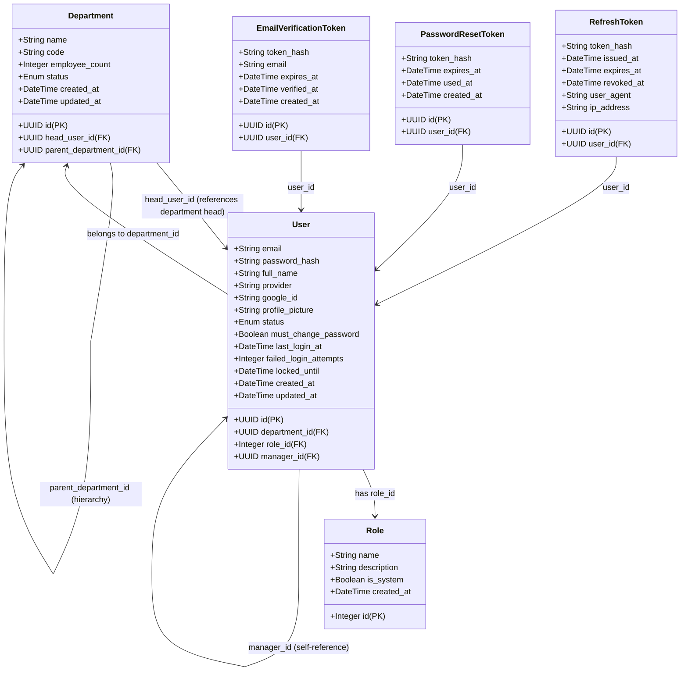

# EcoSphere Audit Report
**Role**: Senior Software Architect & Backend Engineer  
**Project**: EcoSphere ESG Management Platform (Hackathon Edition)  
**Status**: Completed Audit-Only Analysis

---

## 1. Current Repository Tree

Below is the directory structure for both the backend and frontend components of the repository:

```text
OdooX2026-main/
├── backend/
│   ├── app/
│   │   ├── dependencies/
│   │   │   └── auth.py
│   │   ├── models/
│   │   │   ├── __init__.py
│   │   │   ├── department.py
│   │   │   ├── email_verification_token.py
│   │   │   ├── password_reset_token.py
│   │   │   ├── refresh_token.py
│   │   │   ├── role.py
│   │   │   └── user.py
│   │   ├── routes/
│   │   │   └── auth.py
│   │   ├── schemas/
│   │   │   ├── __init__.py
│   │   │   ├── auth.py
│   │   │   ├── google_auth.py
│   │   │   └── user.py
│   │   ├── security/
│   │   │   ├── __init__.py
│   │   │   ├── jwt.py
│   │   │   └── password.py
│   │   ├── services/
│   │   │   ├── auth_service.py
│   │   │   └── google_auth_service.py
│   │   ├── utils/
│   │   │   ├── __init__.py
│   │   │   └── email.py
│   │   ├── config.py
│   │   ├── database.py
│   │   └── main.py
│   ├── alembic/
│   │   ├── versions/
│   │   │   ├── 001_initial_schema.py
│   │   │   ├── 002_seed_initial_data.py
│   │   │   └── 003_add_google_oauth_and_manager_fields.py
│   │   ├── env.py
│   │   └── script.py.mako
│   ├── alembic.ini
│   ├── Dockerfile
│   ├── requirements.txt
│   ├── .env.example
│   ├── QUICKSTART.md
│   ├── README.md
│   └── test_setup.py
├── frontend/
│   ├── src/
│   │   ├── app/
│   │   │   ├── (auth)/
│   │   │   │   └── layout.tsx
│   │   │   ├── (dashboard)/
│   │   │   │   └── layout.tsx
│   │   │   ├── (marketing)/
│   │   │   │   ├── layout.tsx
│   │   │   │   └── page.tsx
│   │   │   ├── error.tsx
│   │   │   ├── globals.css
│   │   │   ├── layout.tsx
│   │   │   ├── loading.tsx
│   │   │   └── not-found.tsx
│   │   ├── components/
│   │   │   ├── layout/
│   │   │   │   ├── breadcrumb.tsx
│   │   │   │   ├── dashboard-layout.tsx
│   │   │   │   ├── header.tsx
│   │   │   │   ├── page-container.tsx
│   │   │   │   ├── sidebar-group.tsx
│   │   │   │   ├── sidebar-item.tsx
│   │   │   │   └── sidebar.tsx
│   │   │   ├── navigation/
│   │   │   │   └── theme-toggle.tsx
│   │   │   └── ui/
│   │   │       ├── button.tsx
│   │   │       └── skeleton.tsx
│   │   ├── config/
│   │   │   └── env.ts
│   │   ├── constants/
│   │   │   ├── api.ts
│   │   │   ├── permissions.ts
│   │   │   ├── roles.ts
│   │   │   ├── routes.ts
│   │   │   └── theme.ts
│   │   ├── hooks/
│   │   │   ├── use-auth.ts
│   │   │   ├── use-breakpoint.ts
│   │   │   ├── use-debounce.ts
│   │   │   ├── use-pagination.ts
│   │   │   └── use-theme.ts
│   │   ├── lib/
│   │   │   ├── api-client.ts
│   │   │   ├── date.ts
│   │   │   ├── formatters.ts
│   │   │   ├── helpers.ts
│   │   │   ├── storage.ts
│   │   │   ├── utils.ts
│   │   │   └── validators.ts
│   │   ├── mocks/
│   │   │   ├── dashboard.ts
│   │   │   ├── departments.ts
│   │   │   ├── environment.ts
│   │   │   ├── governance.ts
│   │   │   ├── reports.ts
│   │   │   ├── social.ts
│   │   │   └── users.ts
│   │   ├── providers/
│   │   │   ├── auth-provider.tsx
│   │   │   ├── index.tsx
│   │   │   ├── query-provider.tsx
│   │   │   └── theme-provider.tsx
│   │   ├── services/
│   │   │   ├── auth.service.ts
│   │   │   ├── dashboard.service.ts
│   │   │   ├── department.service.ts
│   │   │   ├── environment.service.ts
│   │   │   ├── governance.service.ts
│   │   │   ├── report.service.ts
│   │   │   └── social.service.ts
│   │   ├── store/
│   │   │   ├── notification-store.ts
│   │   │   └── ui-store.ts
│   │   └── types/
│   │       ├── api.ts
│   │       ├── auth.ts
│   │       ├── challenge.ts
│   │       ├── dashboard.ts
│   │       ├── department.ts
│   │       ├── environment.ts
│   │       ├── governance.ts
│   │       ├── report.ts
index.html: social.ts
│   │       └── user.ts
│   ├── package.json
│   ├── tsconfig.json
│   └── biome.json
└── docs/
    ├── 00-project-decisions.md
    ├── 01-frontend-architecture.md
    ├── 02-design-system.md
    ├── 03-product-ui-specification.md
    ├── 04-api-contract.md
    ├── 05-component-inventory.md
    └── 06-development-roadmap.md
```

---

## 2. Existing Implemented Features

1. **User Identity & Access Management (Stubbed)**:
   - User registration (`/auth/register`) with automatic creation of email verification tokens.
   - User authentication (`/auth/login`) generating JWT access and refresh tokens.
   - JWT Refresh Token rotation (`/auth/refresh`) and explicit logout (`/auth/logout` / `/auth/logout-all`).
   - Secure token validation helpers and mock transactional email services (logging to console if SMTP is not configured) for password resets and email verification.
2. **Google OAuth Integration (Partial)**:
   - Full callback processing structure (`GoogleAuthService`) that links Google IDs to user accounts or creates new active user entries.
   - Endpoints for generating Google authorization URLs, linking accounts, and unlinking.
3. **Database Foundation**:
   - SQLAlchemy async engine and async session creation.
   - Core initial tables: `roles`, `departments`, `users`, `refresh_tokens`, `password_reset_tokens`, and `email_verification_tokens`.
   - Seed data migrations that populate three initial departments (`Engineering`, `Operations`, `Finance`) and standard test users.
4. **Frontend Architecture & Shell**:
   - Next.js 16 with React 19, TypeScript, Tailwind CSS v4, and Biome linting.
   - Global layout setup including a responsive dashboard container (`Sidebar` + `Header` + `Breadcrumb` + mobile navigation drawer).
   - Global dark/light theme toggle.
   - Service mocks returning standard charts, summary, and action feed telemetry.

---

## 3. Existing Database Models and Relationships



### Models & Columns:
- **`Role`** ([role.py](file:///backend/app/models/role.py)): Auto-incremented primary key, name (unique), description, `is_system`.
- **`Department`** ([department.py](file:///backend/app/models/department.py)): UUID PK, name, code (unique), `head_user_id` (FK to `users.id`), `parent_department_id` (FK to `departments.id` self), `employee_count`, status (`active`, `inactive`).
- **`User`** ([user.py](file:///backend/app/models/user.py)): UUID PK, email (unique), `password_hash`, `full_name`, `department_id` (FK to `departments.id`), `role_id` (FK to `roles.id`), `manager_id` (FK to self), `provider`, `google_id` (unique), status (`active`, `inactive`, `locked`), failed login and lockout timestamp fields.
- **`RefreshToken`** ([refresh_token.py](file:///backend/app/models/refresh_token.py)): UUID PK, `user_id` (FK to `users.id`), `token_hash` (unique), `expires_at`, `revoked_at`.
- **`PasswordResetToken`** ([password_reset_token.py](file:///backend/app/models/password_reset_token.py)): UUID PK, `user_id` (FK), `token_hash` (unique), `expires_at`, `used_at`.
- **`EmailVerificationToken`** ([email_verification_token.py](file:///backend/app/models/email_verification_token.py)): UUID PK, `user_id` (FK), `token_hash` (unique), `email`, `expires_at`, `verified_at`.

---

## 4. Existing API Endpoints

The backend maps exactly **one** router ([auth.py](file:///backend/app/routes/auth.py)) prefixed with `/api/v1/auth`. No other routes exist:

| Method | Endpoint | Description | Auth Required |
|:---|:---|:---|:---|
| **POST** | `/api/v1/auth/register` | Register a new user and generate a verification token. | No |
| **POST** | `/api/v1/auth/login` | Authenticate email/password credentials, return JWT access/refresh. | No |
| **POST** | `/api/v1/auth/refresh` | Rotate access token and refresh token. | No |
| **POST** | `/api/v1/auth/logout` | Revoke a refresh token. | No |
| **POST** | `/api/v1/auth/logout-all` | Revoke all active refresh tokens for the authenticated user. | **Yes** |
| **POST** | `/api/v1/auth/verify-email` | Validate verification token and mark user active. | No |
| **POST** | `/api/v1/auth/reset-password` | Request password reset token via email. | No |
| **POST** | `/api/v1/auth/reset-password/confirm` | Reset password using token. | No |
| **POST** | `/api/v1/auth/change-password` | Change password for authenticated session. | **Yes** |
| **GET** | `/api/v1/auth/me` | Fetch active user credentials. | **Yes** |
| **GET** | `/api/v1/auth/google/login` | Fetch Google OAuth authorization URL. | No |
| **POST** | `/api/v1/auth/google/callback` | Process Google OAuth callback token code. | No |
| **POST** | `/api/v1/auth/google/link` | Link a Google account to an active email user profile. | **Yes** |
| **POST** | `/api/v1/auth/google/unlink` | Unlink a Google profile from an email user profile. | **Yes** |
| **GET** | `/` | Welcoming root endpoint. | No |
| **GET** | `/health` | Health check endpoint. | No |

---

## 5. Existing Authentication and RBAC Implementation

### Authentication Flow:
1. **Credentials verification**: Email/password checks use bcrypt directly on the `User` model, locking the account after 5 consecutive failures for 30 minutes.
2. **Access Token Generation**: High-entropy JWT tokens signed using `HS256` with parameters:
   - `sub`: User UUID
   - `email`: User email
   - `role_id`: Role ID mapping
   - `full_name`: User display name
3. **Session Verification**: The `get_current_user` dependency parses the `Authorization: Bearer <token>` header, extracts the payload, validates signature/expiration, and queries the database for active user metadata.

### RBAC Status (CRITICAL AUDIT FINDING):
- **Placeholder Only**: While `AuthDependencies` contains a `require_role` method, it has **no logic** implemented. It immediately returns the `current_user` without checking if the user's role matches any allowed role.
- **Role Definition Inconsistency**: The system seeds `admin` (ID 1), `asset_manager` (ID 2), `department_head` (ID 3), and `employee` (ID 4) roles in migrations and schemas. This does not match the prompt's specifications (`admin`, `manager`, `employee`) or `00-project-decisions.md` (`Organization Owner`, `Administrator`, `Department Manager`, `Employee`).

---

## 6. Existing Alembic Migration Status

The project contains 3 historical Alembic migrations under `backend/alembic/versions`:

1. **`001_initial`** (`001_initial_schema.py`): Creates tables `roles`, `departments`, `users`, `refresh_tokens`, `password_reset_tokens`, and `email_verification_tokens`. It also seeds initial roles.
2. **`002_seed_data`** (`002_seed_initial_data.py`): Seeds three sample departments (Engineering, Operations, Finance), an admin account (`admin@odoo.com` / `Admin123!`), and three test users.
3. **`003_add_google_oauth_fields`** (`003_add_google_oauth_and_manager_fields.py`): Adds `manager_id`, `provider`, `google_id`, and `profile_picture` columns to `users`, making `password_hash` nullable.

### Migration Schema Bug (CRITICAL AUDIT FINDING):
- In `001_initial_schema.py`, the `departments` table creation contains:
  ```python
  sa.ForeignKeyConstraint(['head_user_id'], ['users.id']),
  ```
  However, the `users` table is not created until later in the migration script. Attempting to run this migration on a clean PostgreSQL database will throw a relation lookup error (`Relation 'users' does not exist`) and fail.

---

## 7. Existing Frontend Status

- **Technology Stack**: Built using Next.js 16 (App Router), React 19, Tailwind CSS v4, Biome, Zustand, and React Query. (Note: In contrast, the prompt calls for a *React + Vite* setup. The workspace is Next.js).
- **Core Shell**: The layout structure (`Sidebar`, `Header`, `Breadcrumb`, mobile drawer toggling) is fully functional and uses Zustand stores (`ui-store` and `notification-store`).
- **Mocks & Services**: All client services return simulated latency delays and static mock data files.
- **Pages Status (CRITICAL AUDIT FINDING)**:
  - The marketing landing page (`src/app/(marketing)/page.tsx`) exists.
  - However, **all other page files are missing**. There are no `page.tsx` routes under `/login`, `/register`, `/dashboard`, `/environment`, `/social`, `/governance`, `/reports`, `/settings`, or `/profile`. Only layout envelopes are in place.

---

## 8. Broken Imports, Bugs, Inconsistencies, and Technical Debt

### A. Critical Bugs:
1. **Migration Failure (Circular FK Dependency)**: Fresh deployments fail immediately during the execution of `001_initial_schema.py` due to `departments` attempting to map a foreign key to `users` before the `users` table exists.
2. **Missing Frontend Routes**: Entering `/login`, `/register`, or `/dashboard` in a browser will yield 404 errors as no `page.tsx` modules exist.
3. **Non-enforced RBAC**: The backend has zero role enforcement. `require_role` is a dummy block.
4. **Timezone Naivety**: Backend utilities and service layers call `datetime.utcnow()`, which returns naive datetimes. This triggers deprecation warnings in newer Python environments and causes timezone discrepancies with PostgreSQL’s `DateTime(timezone=True)` columns.

### B. Architectural & Schema Inconsistencies:
1. **Divergent Roles**: Seeded roles (`admin`, `asset_manager`, `department_head`, `employee`) do not align with target workflows or UI specifications.
2. **Double Hashing Systems**: Password encryption uses raw `bcrypt.hashpw` on the user model, bypassing the `CryptContext` declared in `security/password.py`.
3. **Implicit Database Commit**: `get_db` automatically commits the session on clean function exit. Read operations (HTTP GETs) or functions that fail implicitly can commit unwanted modifications.
4. **Branding Inconsistencies**: Multiple files references "Odoo X" rather than "EcoSphere".

---

## 9. Missing Functionality (Target Architecture vs. Current Code)

The following modules and backend mechanisms are completely unimplemented:

- **Environmental Module**: Models (emission factors, activities, carbon transactions), calculations (CO2e conversion based on input and factors), and tracking routers.
- **Social Module**: CSR events, participation logging, evidence upload, approval tracking, and single-approval reward logic.
- **Governance Module**: Compliance issue tracker, overdue automated checks, governance score impact calculations.
- **Gamification & Rewards**: Challenges, user XP tracking, level up thresholds, badges, inventory stock checks, and atomic point deductions.
- **Scoring Engine**: Logic to recalculate E, S, G, and Overall ESG scores dynamically based on transactions, submissions, and compliance issues.
- **Notification Engine**: Trigger notifications for approvals, compliance issues, rewards, badges.
- **Dashboard API**: Active backend routes summarizing company-wide ESG metrics, charts, activity feeds, and leaderboards.

---

## 10. Optimized P0/P1/P2 Implementation Plan (8-Hour Hackathon)

To maximize output across a 4-person team in an 8-hour window, tasks must be parallelized.

```mermaid
gantt
    title EcoSphere Implementation Timeline (8 Hours)
    dateFormat  X
    axisFormat %Hh
    
    section DB & Schema Fixes (Dev 1)
    Fix Migrations & Align Roles: active, 0, 1
    Environmental Models & Scoring: 1, 3
    Social, Gov, Gamification Models: 3, 5
    Rewards Atomicity & Scoring Sync: 5, 7
    Integrate & Final QA: 7, 8

    section Auth & Core Routers (Dev 2)
    Implement require_role RBAC: 0, 1
    Env & Social API Routers: 1, 3
    Gov & Gamification API Routers: 3, 5
    Rewards & Notification APIs: 5, 7
    API Validation / Swagger Testing: 7, 8

    section Frontend Pages (Dev 3)
    Auth Form validation: 0, 2
    Dashboard & Workspace Pages: 2, 4
    Env & Social Modules: 4, 6
    Gov, Rewards & Reports Modules: 6, 8

    section Client Integrations (Dev 4)
    Refactor apiClient (headers/JWT): 0, 2
    Connect Auth & User Store: 2, 4
    Integrate Dashboard & Env API: 4, 6
    Integrate Social, Gov & Rewards: 6, 8
```



### Allocation of Roles:
- **Developer 1 (Database & Scoring)**: DB transactions, models, migration fixes, scoring updates.
- **Developer 2 (API & RBAC)**: Router layers, security policies, backend validation, business services.
- **Developer 3 (Frontend Views)**: Implementing pages (`page.tsx`), component composition, forms, chart views.
- **Developer 4 (State & Integration)**: Connecting `apiClient`, queries, mutations, Zustand sync.

### Phase P0 (Hours 0 - 3): Foundational Fixes & Core Environmental Workflow
* **DB & API**:
  - Fix circular dependency in `001_initial_schema.py`.
  - Align database seeded roles to `admin`, `manager`, `employee`.
  - Implement role enforcement inside `require_role`.
  - Create models: `EmissionFactor`, `EnvironmentalActivity`, `CarbonTransaction`, `ESGScore`.
  - Write environmental logic: input processing -> emission factor lookup -> CO2e calculation -> carbon transaction write.
* **Frontend**:
  - Add auth token injection and interceptors inside `api-client.ts`.
  - Create `/login` and `/register` route pages. Connect hooks for login/register form actions.

### Phase P1 (Hours 3 - 6): Social, Governance & Gamification Modules
* **DB & API**:
  - Create models: `CsrActivity`, `CsrParticipation`, `ComplianceIssue`, `Challenge`, `ChallengeParticipation`, `Badge`, `UserBadge`.
  - Implement idempotent approvals for CSR participation and challenges.
  - Implement governance issue creation and overdue validation logic.
  - Write transaction-based score recalculation hooks (E, S, G changes triggering recalculations).
* **Frontend**:
  - Create `/dashboard` page and wire up chart visualizations (Recharts).
  - Create `/environment` activity sub-pages.
  - Create `/social` and `/governance` layout pages.

### Phase P2 (Hours 6 - 8): Rewards, Notifications, Reports & QA
* **DB & API**:
  - Create models: `Reward`, `RewardRedemption`, `Notification`.
  - Implement atomic reward redemption (checking points, deducting points, decrementing stock in a single database transaction block).
  - Add email or in-app notification triggers.
  - Test suite review and API contract mapping through Swagger at `/docs`.
* **Frontend**:
  - Create `/reports` page (export triggers).
  - Connect settings, profile, and active notification panel.
  - Run full QA end-to-end user flows.

---

## 11. Exact Recommended Next Implementation Step

**Action Item 1: Resolve circular dependency migration bug and align roles.**
Before building any new models, we must fix the database migration structure so that we can spin up fresh PostgreSQL instances.
1. Modify `backend/alembic/versions/001_initial_schema.py` to remove the foreign key constraint `sa.ForeignKeyConstraint(['head_user_id'], ['users.id'])` from the `departments` table creation block.
2. In the same file, add the foreign key constraint via `op.create_foreign_key` *after* the `users` table has been created successfully.
3. Update the seeded roles in `001_initial_schema.py` to seed `admin`, `manager`, and `employee` instead of the old roles, and align the `UserRole` enums in both the models and schemas.

## Backend Testing Summary — Antigravity

**Date:** July 12, 2026
**Scope:** Local environment setup + backend boot/migration testing

### Environment Setup
- Cloned repo fresh, set up Python venv, installed dependencies (requirements.txt)
- Spun up local PostgreSQL via Docker (esg-postgres container)
- Configured .env with local DB connection and JWT secret

### Bugs Found & Fixed
1. Import error (fixed, pushed): app/schemas/user.py incorrectly imported UUID from typing instead of uuid module — caused immediate server crash on boot.
2. Missing export (fixed, pushed): app/models/__init__.py did not export Base from app.database, breaking Alembic's model discovery (ImportError: cannot import name 'Base').

### Bugs Found — Not
